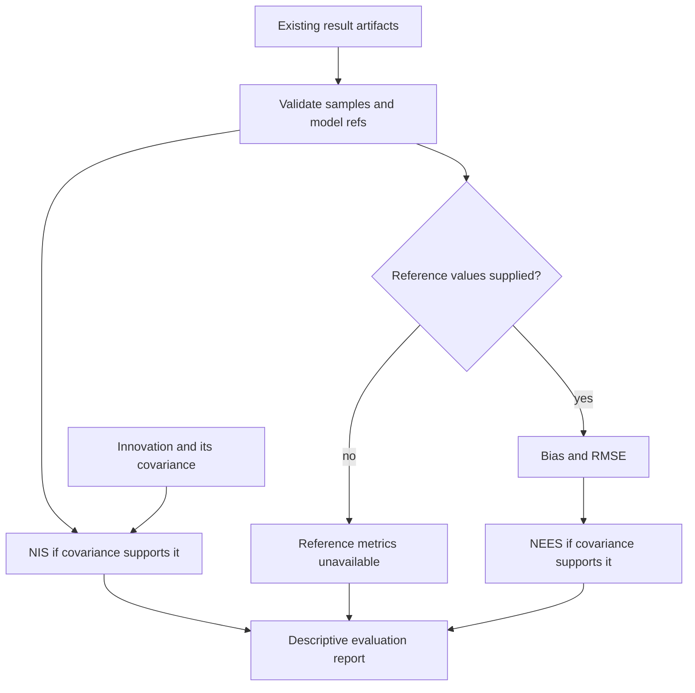

# Estimator Bench

**Evaluate supplied estimator results against declared references and inspect exchange and replay bindings.**

| NET micro-tool | Identity and scope |
| --- | --- |
| User-facing name | **Estimator Bench** |
| Proposed NET operation family | `bench.estimator` |
| Implementation repository | `State-Estimation-Evaluation-Testbed` |
| Existing provider and import | State Estimation Evaluation Testbed / SET; `state_estimation_testbed` |
| Existing APIs | `evaluate_samples`, `verify_replay_bundle`, and instrument exchange validators |
| Current boundary | Bounded declared-reference metrics, exchange validation and native-session replay binding; no estimator or simulation/fault-injection runner |

`bench.estimator` is the agreed NET-facing target, **not a newly registered
command or a completed universal benchmark suite**. Use the existing APIs and
test instructions below. Callers supply model references, result artifacts and
any reference truth or innovations. Unsupported normalized metrics remain
unavailable; the tool does not invent truth or an uncertainty matrix.

NET owns session composition and provider execution; this repository owns its
evaluation and validation contracts. **Replay Test** adds separate profile-bound
session conformance and comparison. Evidence, operation specifications, execution
attempts, results and verification records retain separate identities.
Repository URLs, imports, schemas, historical evidence/pins and existing licence
terms are unchanged by this documentation update.

Part of **Notation Systems Inc's computational instrumentation and evidence infrastructure** for industrial and cyber-physical systems.

[Stack map](https://github.com/giasonpooni/Notations-Engineering-Terminal/blob/main/docs/STACK.md) · [Component role and interfaces](docs/STACK_ROLE.md)

**Early-stage evaluation infrastructure for state reconstruction under degraded observations.**

This repository defines the state-estimation evaluation responsibility within
Notation Systems Inc's computational instrumentation stack. Its scope covers
reconstruction under noise, missing observations, latency, and other measurement
degradation, with the plant and measurement model declared explicitly.

## Organization

**Notation Systems Inc** is the parent organization.

| Division | Focus |
| --- | --- |
| **Notations Gaming** | Games, graphics and interactive worlds. |
| **Notations Manufacturing** | Industrial design, materials and manufacturing systems. |
| **Notations Laboratories** | Research, scientific computing, simulation and experimental validation. |

This repository contributes estimator evaluation and conformance tools to **Notations Laboratories**, supporting validation workflows across the divisions.

## Status and implemented contents

This checkout contains a declarative invariant corpus, its citation, executable
exchange validators, a bounded declared-reference evaluation runner, and a
content-binding verifier for native CIW telemetry and calibrated-observable replay sessions. It does not
contain an estimator, simulation, fault-injection runner, benchmark results,
or physical-validation certificate.

The existing corpus declares:

- `plant.declared`: estimation requires a declared plant and measurement model.
- `var.x`: the state coordinate requires `declared-H`.
- `claim_scope: computational-integrity-only`.

These declarations do not establish physical validity, estimator accuracy,
observability, or a stability certificate. Noise, missingness, and latency are
evaluation concerns, not implemented perturbation generators in this checkout.

### Declared-reference metric workflow

Solid arrows describe the implemented evaluation API. Unknown or singular
covariance can leave a normalized metric unavailable while other supported
metrics remain reportable. Invalid inputs are rejected. The report does not
supply an estimator, generate degraded observations, or establish the reference
values as physical truth. Replay binding is a separate implemented operation,
described below and in the [Instrumentation diagram atlas](https://github.com/giasonpooni/Notations-Engineering-Terminal/blob/main/docs/DIAGRAMS.md).

### Instrument exchange contract

`state_estimation_testbed.contracts` validates the v1 instrument exchange
boundary for observation batches, numerical result artifacts, verification
artifacts, and covariance eligibility. It enforces:

- ordered variables, per-component units, coordinate frame, and tangent-space
  evaluation point;
- finite square covariance matrices, symmetry and numerical positive-semidefinite
  checks under the tolerances described below, with an effective-rank estimate;
- explicit unknown covariance rather than a fabricated zero matrix;
- retained source and calibration references; and
- verification summaries consistent with their checks, with internal and
  independent verification kept distinct.

Numerical eligibility does not establish calibration validity, sensor truth,
model adequacy, physical applicability, estimator accuracy, or stability.
Identity fields are references, not authenticated attestations: validation does
not fetch their subjects, recompute producer-specific content hashes, establish
admission, or independently substantiate a declared external verifier.

Run the contract, metric, replay-binding and NumPy differential tests with
`python -m pytest`. The package itself remains dependency-free.

#### Supported Python runtime

Python **3.11 or newer** is required; the hosted test matrix covers 3.11, 3.12,
and 3.13. The full suite passed on those three runtimes in
[run 35546181812](https://github.com/giasonpooni/State-Estimation-Evaluation-Testbed/actions/runs/35546181812)
at revision `1467ec5058b3e7ebd6ba4a45f2d9b49148a2560d`.

That run exposed an unsupported Python 3.10 path: the existing timestamp
validator's `datetime.fromisoformat` call rejects the accepted UTC timestamp
`2026-09-20T12:00:00.123456789Z` after its UTC-suffix conversion. The unchanged
`test_fractional_timestamps_and_distinct_clock_order_are_preserved` regression
therefore fails on 3.10. The declared runtime floor and CI matrix reflect the
verified 3.11+ baseline; no test is skipped and no timestamp contract or
executable validator source is changed to accommodate 3.10. Acceptance retains
the original timestamp string; this does not claim nanosecond `datetime`
arithmetic precision.

### Declared-reference evaluation (API 0.3)

`state_estimation_testbed.evaluate_samples(samples, model_ref=...)` accepts
existing result-artifact v1 objects under each sample's `result` key. Optional
`truth_components` use the same ordered name/value/unit representation as
the result. Optional numeric `innovation` follows the ordered variables of its
mandatory `innovation_covariance` declaration. The operation reports per-axis
bias/RMSE and per-sample NEES/NIS where the declarations support them.

Every estimate must retain the declared model reference. Missing reference
truth yields no bias/RMSE/NEES. Unknown, singular or asymmetrically stored
covariance yields an unavailable normalized metric, not a fabricated zero or
a pseudoinverse-based certainty claim. Nonfinite values, boolean/string numeric
coercion, duplicate sample identities, and normalized metric overflow or
underflow-to-false-zero are rejected. These are descriptive measurements
against caller-declared reference data: the API makes no pass/fail calibration,
coverage, independence, sensor-truth, physical-accuracy or stability claim.

Samples must share the complete covariance frame, including its evaluation
point. Reference values are declared in that frame; an optional `truth_frame`
must match it exactly. Nonrepresentable integer inputs are refused before
arithmetic, and exact accumulation/scaled RMS protect subnormal errors from
being reported as a perfect zero.

### Native CIW replay binding (API 0.3)

`state_estimation_testbed.verify_replay_bundle(bundle, replay_results=...)`
checks a `ciw.telemetry-session.v1` or `ciw.calibrated-observable-session.v1`
native session and returns the existing
`notation.instrument.verification-artifact.v1` envelope. It does not introduce
a replacement wire protocol or import an estimator. The full implemented
[binding interface](docs/replay-binding.md) distinguishes retained evidence,
operation/runtime pins, execution occurrences, numerical outputs and verification.
The calibrated session additionally binds retained FSRT experiment bytes to the
declaration request, result identity, channel order and complete configuration.

The caller must perform fresh computation using separately approved clean
source/interpreter pins and provide an execution-ID-to-numerical-output mapping.
Without that mapping, the receipt is **indeterminate**, even when all content
hashes pass. A mismatching replay produces a failed receipt. SET itself does not
launch producers, authenticate runtime declarations or confer admission authority;
an untrusted subject's passed receipt must never stand in for fresh verification.

#### Validator API 0.2 compatibility

The wire schemas remain `notation.instrument.*.v1`; validator API 0.2 tightens
previously ambiguous or unsafe validation behavior:

- `CovarianceValidation.effective_rank` is `None` for `unknown` and
  `not_applicable`. A supplied all-zero matrix has rank `0`; missing covariance
  does not. Consumers must handle the nullable rank explicitly.
- Finite, nonnegative variances are mandatory. A zero variance requires an
  exactly zero row and column. Positive-variance coordinates are normalized to
  dimensionless correlations before symmetry, PSD, and rank checks, so changing
  one variable's physical units does not hide another variable's uncertainty.
- Tolerances are finite numbers in `[0, 1)`, expressed in correlation
  coordinates. Both stored triangles must pass the symmetric-eigenspectrum
  check; the matrix is neither averaged nor repaired. Effective rank is the
  smaller triangle rank if tolerated asymmetry straddles the rank threshold.
  Floating-point decisions close to that threshold remain tolerance-dependent.
- The dependency-free Jacobi eigensolver fails closed on nonconvergence.
  It replaces the scale-sensitive unpivoted LDL check; the rank-one covariance
  `[[1e-14, 1e-7], [1e-7, 1]]`, formerly rejected, now validates with rank `1`.
  Optional NumPy differential tests exercise singular/full-rank matrices,
  permutations, indefinite correlations, and extreme mixed-unit scales;
  NumPy is not required by the validator itself.
- Tangent frames require an ordered basis and a finite evaluation point. The
  point's dimension need not equal state dimension (for example, a 2D tangent
  plane in 3D). These declarations do not establish a valid frame transform.
- Timestamps must include a complete date and time in
  `YYYY-MM-DDTHH:MM:SS[.fraction]Z` form; leap seconds are not supported.
  Observation/receipt ordering is not inferred without a clock mapping.
- Covariance calibration references must also be retained at the artifact
  level. Result, execution, input, verification, and subject references cannot
  reuse the same identity where they denote different artifacts.

## Technical responsibility

The testbed's responsibility is to evaluate state reconstruction against a
declared model and explicitly characterized observations. Estimator
implementations retain their own identities and mathematical assumptions; this
repository is not the authoritative implementation of every estimator.

A reported evaluation must distinguish its source observations, model
declarations, estimator operation and version, execution attempt, computed
result, and verification evidence. Declaring an invariant is separate from
executing an evaluation or verifying its result.

## Relationship to the instrumentation stack

These are component responsibilities, not claims of complete working
integrations in this early-stage repository.

| Component | Responsibility |
| --- | --- |
| **Estimator Bench / State Estimation Evaluation Testbed** | Evaluation of reconstruction under declared observation degradation. |
| [Data Intake / Provenance-Preserving Data Acquisition](https://github.com/giasonpooni/Provenance-Preserving-Data-Acquisition) | Source acquisition, observations, extraction lineage, and explicit missingness. |
| [State Ledger / Evidence and State Management](https://github.com/giasonpooni/Evidence-and-State-Management) | Evidence retention, versioned state, admission, and release management. |
| [Scientific Computation Runtime](https://github.com/giasonpooni/Scientific-Computation-Runtime) | Declared scientific computations and provenance-bearing execution. |
| [Constraint-Based State Reconciliation](https://github.com/giasonpooni/Constraint-Based-State-Reconciliation) | Reconciliation against declared physical or structural constraints. |
| [Geospatial State Visualization](https://github.com/giasonpooni/Geospatial-State-Visualization) | Read-only presentation of geographic and temporal state. |
| [Notations Engineering Terminal (CIW)](https://github.com/giasonpooni/Notations-Engineering-Terminal) | Existing instrument sessions, adapters, inspection, and replay. |

Evaluation, reconciliation, execution, information governance, and visualization
remain separate responsibilities. A display or evaluation result does not grant
authority to change retained evidence or operational state.

## Repository identity and compatibility

The repository was renamed from `State-Estimation-Testbed` to
`State-Estimation-Evaluation-Testbed`. Use the current repository name and
location for documentation and new references.

This naming change preserves the existing `invariant-corpus-v1` schema,
invariant IDs, state-coordinate ID, declared claim scope, and historical
`cites` value. It does not rewrite operation identities, evidence, execution
records, or historical runtime pins.

## Repository contents

- [Invariant corpus](validation/invariant-corpus-v1.json)
- [Corpus citation and claim boundary](docs/invariant-corpus-cite-v1.md)
- [License](LICENSE)
