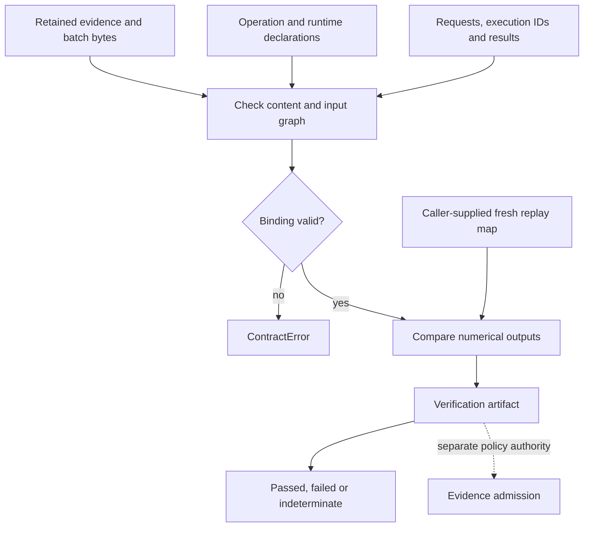

# Native CIW session content binding

The verifier bounds canonical session size to 8 MiB, nesting to 64 levels,
steps to 32, and each exchange artifact to 64 components. Retained source-byte
decoding rejects duplicate keys, nonfinite values and nonzero floating literals
that underflow to zero. The caller must use an equivalently strict decoder for
the outer session: a Python dictionary cannot recover values already lost by
an unsafe upstream parser. Declared native operation identities must agree with
their enclosing step operation.

The sole explicit composite mapping is CIW's `ciw.gsie-predict-update.v1`:
its `ciw.estimation-step.v1` result wrapper must declare, in order,
`geometric-state-inference.predict.v1` and `geometric-state-inference.update.v1`
under `component_operations`, while its nested existing result artifact retains
the native update `operation_ref`. The step runs under `gsie`. Other operation
aliases or implicit substitutions are not accepted. The pinned replay executor
is still responsible for executing and verifying both declared operations.

Implemented API: `state_estimation_testbed.verify_replay_bundle`.
Supported subjects: CIW's `ciw.telemetry-session.v1` and additive
`ciw.calibrated-observable-session.v1`. The result uses the existing
`notation.instrument.verification-artifact.v1` schema, with additive `binding`
details. Existing exchange validation behavior and wire schemas are unchanged.

## Content binding and numerical replay

Solid arrows show checks performed here and inputs consumed by them. A missing
fresh replay map yields an indeterminate numerical-replay outcome; disagreement
yields failed. SET does not launch the producer. The caller obtains fresh outputs
from separately approved source/interpreter pins and keys them by execution ID.
Hash agreement alone cannot select or authenticate that executor.

Evidence, operation, execution and result references remain bound in the receipt;
the receipt receives its own verification identity and declares
`independent: false`. The dotted admission edge is an authority boundary, not
an implemented admission action. See the [Instrumentation diagram atlas](https://github.com/atomtrapping/Notations-Systems-Terminal/blob/main/docs/DIAGRAMS.md).

## Retained subject

| Session field | Binding checked |
| --- | --- |
| `session_id`, `created_at` | Explicit session identity and UTC instant |
| `source.batch` | Telemetry session: existing observation-batch v1 contract |
| `source.batch_bytes_b64`, `source.batch_sha256` | Telemetry session: exact byte digest and strict decoded JSON equality to the batch; duplicate object keys forbidden |
| `source.experiment_id`, `source.experiment_digest` | Calibrated session: identity and canonical content digest of the strictly decoded retained FSRT experiment |
| `source.evidence[]` | Unique `artifact_ref`, exact retained `bytes_b64`, `sha256`; telemetry batch source references must resolve; calibrated sessions retain exactly one experiment artifact |
| `configuration` | Full retained configuration digest; prior/model/settings belong in this object and the actual step requests |
| `runtimes` | Existing `ciw.subprocess-runtime.v1` records, full revision/tree pins and interpreter-byte hash |
| `steps[]` | Ordered operation/runtime, input graph, distinct execution/result identities, complete request/result hashes and occurrence-free numerical output digest |
| `bundle_digest` | Entire native session except `bundle_digest`, `verification`, `replay_receipts` |

Step fields are `operation_id`, `runtime_ref`, `execution_id`, `input_refs`,
`request`, `request_sha256`, `result`, `result_sha256`, `result_id`,
`numerical_result`, and `numerical_result_id`. Each `runtime_ref` resolves to
a key of `runtimes`. In telemetry sessions, the first step is a pinned `ppda` projection from retained
evidence into the exact `source.batch`; later inputs resolve to retained
evidence or earlier result identities. Exchange results retain their own
`result_id`/`batch_id`, `execution_ref` and `input_refs` consistently with the
step graph. `numerical_result` excludes top-level occurrence `result_id`,
`execution_id`, `execution_ref` and `created_at` fields.

In calibrated sessions, the first step is the pinned `fsrt` operation
`fsrt.declare-calibrated-two-channel.v1`. Its request must contain the exact
decoded experiment and the step execution identity. The native declaration
must bind that experiment's identity, schema-domain content digest, channel
order and claim scope; its result identity must bind the declaration content.
Its numerical projection must match that retained declaration after excluding
schema, operation and occurrence fields. Every later
`ciw.calibrated-operation-result.v1` result also binds its own content identity
with a canonical digest of all fields except `result_id`.
The session configuration must equal the retained experiment configuration.
This prevents an otherwise rehashed session from substituting a different
experiment, model configuration or occurrence. Later steps use the same ordered
input graph and digest rules as telemetry sessions. FSRT owns scientific
declaration validation; SET does not repeat clock, calibration, observability,
estimation, reconciliation or fault-isolation calculations.

Every embedded result-artifact v1 also passes the existing schema-domain
content-ID check, including a native result nested in a CIW wrapper. Rehashing
the surrounding session cannot conceal a stale producer result identity.
Observation-batch IDs retain their existing caller-declared-reference semantics.

The digest profile is explicitly Python JSON: UTF-8, sorted string object keys,
compact separators, `ensure_ascii=False`, `allow_nan=False`. Arrays remain
ordered, `1` and `1.0` remain distinguishable, and nonfinite JSON numbers fail.
This is not a claim of RFC 8785/JCS interoperability. JSON content digests and
exact-byte digests are `sha256:<64 lowercase hex>`. Existing runtime Git pins
and interpreter hashes keep their existing unprefixed formats.

## Verification and trust

Call `verify_replay_bundle(bundle, replay_results=fresh_mapping)` where
`fresh_mapping` maps every step's execution ID to its freshly recomputed
`numerical_result`. The execution-key set must match exactly. Missing mapping
produces `numerical-replay: indeterminate`; mismatched numerical content yields
`failed`; exact matches yield `passed`. Tampered or malformed binding raises
`ContractError`. No old receipt is consumed as evidence of success.

The receipt's `binding` retains bundle/configuration digests, evidence digests,
operation/runtime/request pins, numerical-result IDs and execution IDs. Its
verification identity follows the existing exchange profile:
`sha256(schema_utf8 + NUL + canonical_receipt_without_verification_id)`.
`independent` is always false. The deterministic default receipt time is the
session time; callers producing an occurrence record should pass their fresh
`created_at` explicitly. Timestamp choice does not authenticate verification.

Runtime paths and declarations inside an untrusted bundle must not select
executables. CIW/ESM must obtain replay outputs from separately configured
approved clean checkouts and interpreter/dependency manifests. The verifier
binds supplied values but cannot authenticate a caller or make a fabricated
`replay_results` mapping trustworthy. Its pass is computational binding and
output reproduction, not calibration, physical truth, observational accuracy,
constraint applicability, unique fault isolation, evidence admission or release.
Unknown covariance remains unknown even when a replay reproduces it exactly.
